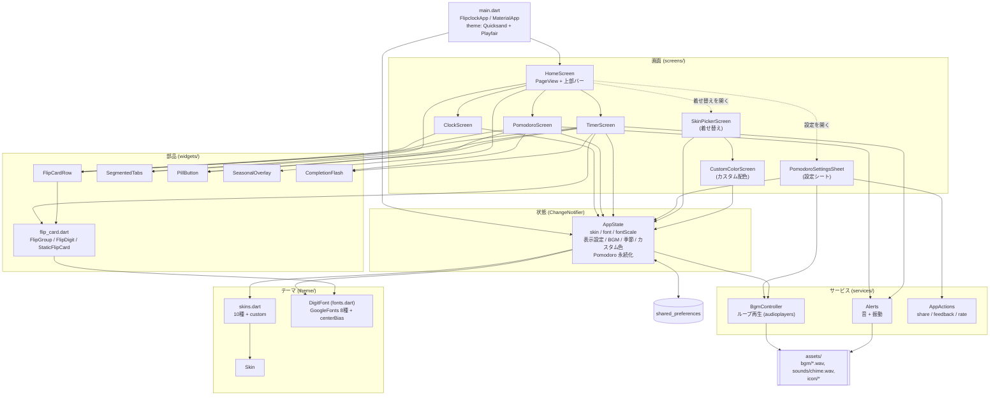
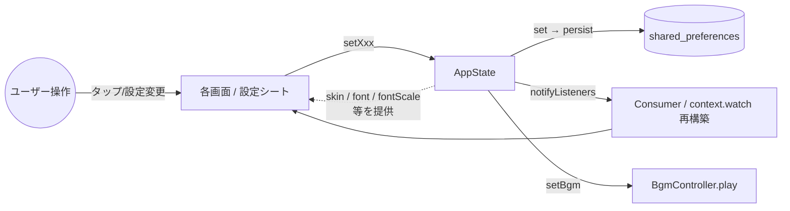
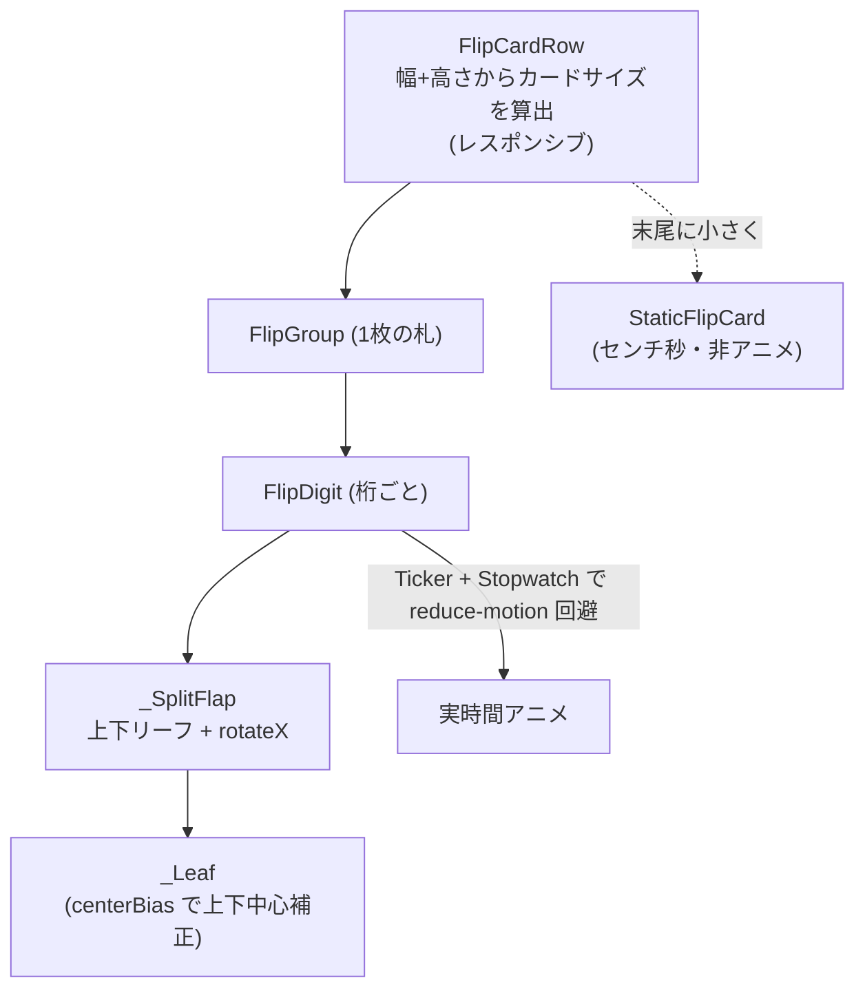
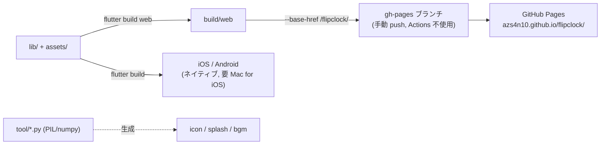

# flipclock アーキテクチャ

ゆめかわ系フリップ時計アプリ（Clock / Pomodoro / Timer + 着せ替え）。
Flutter（web / iOS / Android）製。状態管理は `provider`、永続化は
`shared_preferences`。

## レイヤー構成と依存

## 状態とデータの流れ

- 設定はすべて `AppState` の `setXxx()` 経由で `shared_preferences` に保存され、
  `notifyListeners()` で全画面が再描画される。
- Pomodoro は終了時刻を絶対時刻で保存（`savePomodoro`）し、アプリを閉じても
  復元・経過反映できる。

## フリップ描画の構造

## 外部パッケージ

| 用途 | パッケージ |
|---|---|
| 状態管理 | provider |
| 永続化 | shared_preferences |
| フォント | google_fonts |
| 音 / BGM | audioplayers |
| 日付整形 | intl |
| 共有 | share_plus |
| メール/URL | url_launcher |
| レビュー | in_app_review |
| 配色ピッカー | flutter_colorpicker |
| アイコン生成(dev) | flutter_launcher_icons |
| 起動画面生成(dev) | flutter_native_splash |

## ビルド & デプロイ

- web は `gh-pages` ブランチへ手動デプロイ（支払い状況に依存しないよう Actions 非使用）。
- アイコン・起動画面・BGM 音源は `tool/` の Python スクリプトで生成。
